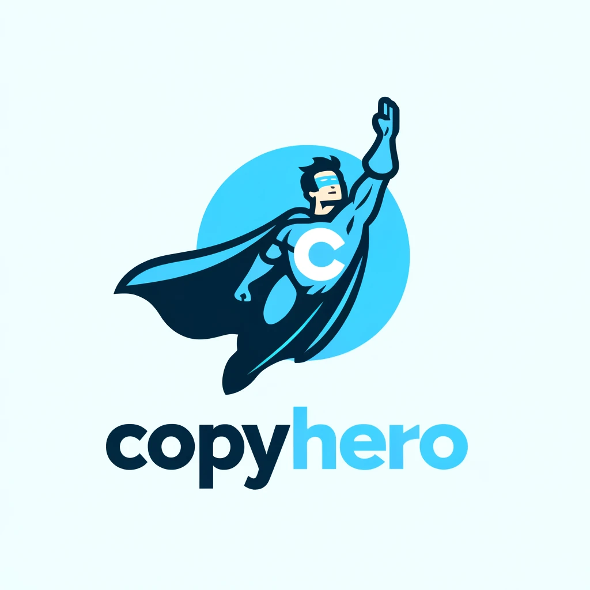

CopyHero
========
<a href="https://copyhero.net"></a>

**CopyHero Open Source Version** can easily copy text from images. It is easy to integrate into the website or software through Javascript SDK.CopyHero's OCR is based on [PaddleOCR](https://github.com/PaddlePaddle/PaddleOCR).It's completely **free**.

How CopyHero works for you
--------------------------
If your website or software users are the following, it is recommended to integrate CopyHero.

1. Website or software for students and educators: extract text from textbooks, handouts, PPT and other images to facilitate note organization and study research.

1. Website or software for researchers and scholars: extract text from papers, documents, and book scans to facilitate quick citation and organization of materials.

1. Website or software for office workers: quickly extract text for editing and analysis when processing image files such as charts, reports, and contracts.

1. Website or software for developers and programmers: extract code snippets or text content from screenshots, documents, and design drawings to improve work efficiency.

1. Website or software for freelancers and content creators: extract text from various image materials for creation, translation, writing, and content editing.

1. Website or software for people with visual impairments: extract text from images and convert them into text formats that can be recognized by screen readers to improve the convenience of information acquisition.

1. Website or software for language learners: extract text from foreign language text in images to facilitate translation and language learning.

1. Website or software for practitioners in the legal and financial industries: extract text from scanned copies of contracts, agreements, financial statements, etc. to improve work efficiency and accuracy.


## 1 Deploy via Docker

Requirements
------------
  * docker 20.0 (or greater)
  * docker-compose 1.29.2 (or greater)

### 1.1 Install CopyHero

    git clone https://github.com/CopyHero/CopyHero
    cd CopyHero
    docker-compose up -d

### 1.2 Check if it is correct

    wget http://127.0.0.1:8899/info

## 2 Deploy via code
CopyHero now supports bleeding-edge installations. The easiest way to
install the software and track updates is to clone the public repository.
Create a folder on you web server (using whatever method makes sense for
you) and cd into it. Then clone the repository (the folder must be empty!):

Requirements
------------
  * Python version 3.8 (or greater)
  * Mongo version 7.0.9 (or greater) [How to install MongoDB](https://www.mongodb.com/docs/manual/installation/)
  * PaddleOCR 2.7.1 (or greater)

### 2.1 Install CopyHero

    git clone https://github.com/CopyHero/CopyHero

And deploy the code into somewhere in your server's www root folder, for
instance

    cd CopyHero
    python3 -m venv ./venv
    ./venv/bin/pip install -r ./requirements.txt

### 2.2 Install PaddlePaddle (GPU)

> If you do not have a Python environment, please refer to [Environment Preparation](./environment_en.md).

- If you have CUDA 11 installed on your machine, please run the following command to install

  ```bash
  ./venv/bin/pip install paddlepaddle-gpu
  ```

### 2.3 Start CopyHero
```bash
nohup ./venv/bin/uvicorn app.main:app --host 0.0.0.0 --port 8899 &
```

### 2.4 Check if it is correct

    wget http://127.0.0.1:8899/info


Help
----
Visit the [Documentation](https://docs.copyhero.net/).

Contributing
------------
Create your own fork of the project and use
[git-flow](https://github.com/nvie/gitflow) to create a new feature. Once
the feature is published in your fork, send a pull request to begin the
conversation of integrating your new feature into CopyHero.


License
-------
CopyHero is released under the GPL2 license. See the included LICENSE.txt
file for the gory details of the General Public License.

CopyHero is supported by several magical open source projects including:

  * [PaddleOCR](https://github.com/PaddlePaddle/PaddleOCR)
  * [Mongo](https://github.com/mongodb/mongo)
